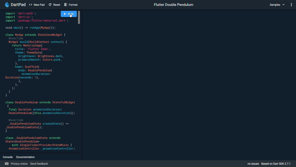

# double_pendulum

A flutter project to simulate double pendulum using Custom Paint widget.

## How it looks like

## Live version available

https://dartpad.dev/0f44a277acdeaacfbf3d86e9b1405756

<iframe src="https://dartpad.dev/embed-inline.html?id=0f44a277acdeaacfbf3d86e9b1405756&split=20&theme=dark></iframe>
## Major inspiration

https://observablehq.com/@travisdoesmath/double-pendulums-are-chaotic

### Main Reference

https://www.youtube.com/watch?v=uWzPe_S-RVE
https://www.myphysicslab.com/pendulum/double-pendulum-en.html

## Note of Caution

This physics used is not in correct scale and might differ from correct results.
This is more of fun project to test Custom Painter.

## Getting Started

This project is a starting point for a Flutter application.

A few resources to get you started if this is your first Flutter project:

- [Lab: Write your first Flutter app](https://flutter.dev/docs/get-started/codelab)
- [Cookbook: Useful Flutter samples](https://flutter.dev/docs/cookbook)

For help getting started with Flutter, view our
[online documentation](https://flutter.dev/docs), which offers tutorials,
samples, guidance on mobile development, and a full API reference.
